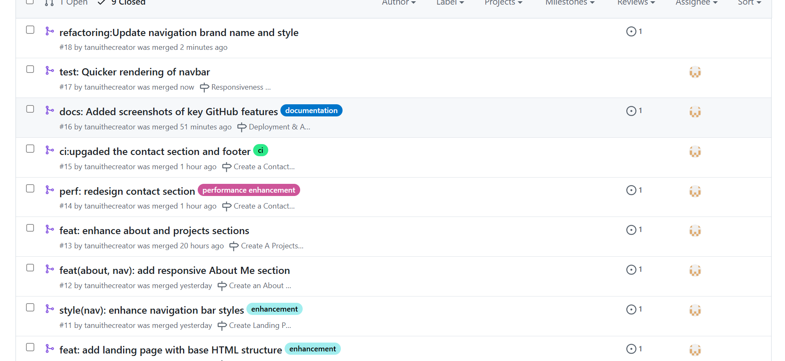

# Personal Portfolio Documentation

## 1. Student Details

- **Julian Tanui**
- **150777**
- **@tanuithecreator**
- **julian.tanui@strathmore.edu**

## 2. Deployed Portfolio Link

- **GitHub Pages URL**:  
(https://is-project-4th-year.github.io/build-your-portfolio-github-workflow-essentials-tanuithecreator/)

## 3. Learnings from the Git Crash Program

### 🧠 What I Thought I'd Learn vs What I Actually Learned

#### **1. Concept: GitHub Projects & Issues**

- **Expectation 👀**:  
  I thought Projects and Issues were just for large teams managing thousands of tasks across big software builds.

- **Reality 😅**:  
  They’re actually super helpful even for solo work! I used issues to break my portfolio into small, trackable tasks—like “Add contact form” or “Style landing page”—and moved them across a project board like a pro.

- **Impact 💡**:  
  It gave structure to my workflow. Instead of randomly editing files, I had a clear plan and could focus on finishing one thing at a time.

---

#### **2. Concept: Commit Messages**

- **Expectation 👀**:  
  I figured you just write “update” or “fix stuff” and move on. Who reads commit messages anyway?

- **Reality 😅**:  
  Turns out good commit messages save time *and* look super professional. I learned to use `feat:`, `fix:`, and other prefixes that made my project history clean and easy to read.

- **Impact 💡**:  
  My commit history now tells the full story of my portfolio’s progress—great for collaboration, and future-me will thank me when I need to debug something.

---

#### **3. Concept: Git Pull, Push, and Merge**

- **Expectation 👀**:  
  I assumed pulling and pushing were just syncing changes, and merging was only needed when working with others.

- **Reality 😅**:  
  I had to deal with merge conflicts—even on my solo project! It taught me how important it is to manage branches properly and review changes before merging.

- **Impact 💡**:  
  I confidently used `git pull origin main` and `git merge` when syncing my feature branches. Understanding this flow helped me avoid breaking my main site accidentally.

---

#### **4. Concept: Branching Strategy**

- **Expectation 👀**:  
  I thought one branch was enough. Why complicate things?

- **Reality 😅**:  
  Branching helped me experiment without fear. I made a `feature/home-page` branch to test different hero section styles without touching the main branch.

- **Impact 💡**:  
  I built and tested parts of my portfolio in isolation, then merged them safely. It boosted my confidence and reduced stress—no more "Oops, I broke the home page!" moments.

---
## 4. Screenshots of Key GitHub Features

### A. Milestones and Issues

- The milestones were grouped into sections that the portfolio would contain and the issues assigned to specific milestones depending on  the best fit.

### B. Project Board

- This project board helped me keep track of the issues as i solved them sequentially

### C. Branching

- The branches were named in relation to what was going to be the main development focus in that issue
### D. Pull Requests

- This pull request is linked to issue #5 under the Create a project section milestone, it is already merged with main
### E. Merge Conflict Resolution

 

- Resolved merge conflict in a pull request
